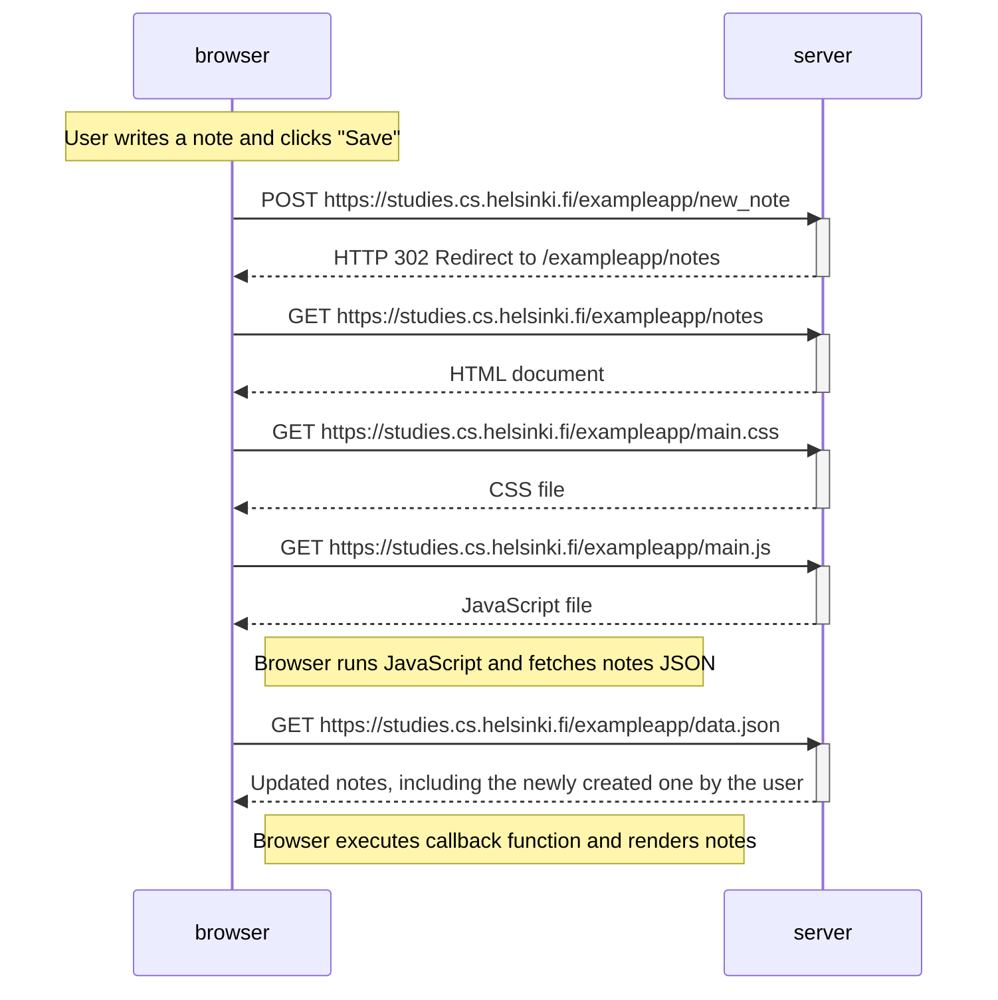

```mermaid
sequenceDiagram
  participant browser
  participant server

  Note over browser: User writes a note and clicks "Save"

  browser->>server: POST https://studies.cs.helsinki.fi/exampleapp/new_note
  activate server
  server-->>browser: HTTP 302 Redirect to /exampleapp/notes
  deactivate server

  browser->>server: GET https://studies.cs.helsinki.fi/exampleapp/notes
  activate server
  server-->>browser: HTML document
  deactivate server

  browser->>server: GET https://studies.cs.helsinki.fi/exampleapp/main.css
  activate server
  server-->>browser: CSS file
  deactivate server

  browser->>server: GET https://studies.cs.helsinki.fi/exampleapp/main.js
  activate server
  server-->>browser: JavaScript file
  deactivate server

  Note right of browser: Browser runs JavaScript and fetches notes JSON

  browser->>server: GET https://studies.cs.helsinki.fi/exampleapp/data.json
  activate server
  server-->>browser: Updated notes, including the newly created one by the user
  deactivate server

  Note right of browser: Browser executes callback function and renders notes
```
