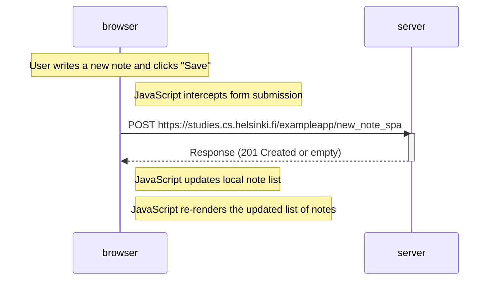

```mermaid
sequenceDiagram
  participant browser
  participant server

  Note over browser: User writes a new note and clicks "Save"

  Note right of browser: JavaScript intercepts form submission

  browser->>server: POST https://studies.cs.helsinki.fi/exampleapp/new_note_spa
  activate server
  server-->>browser: Response (201 Created or empty)
  deactivate server

  Note right of browser: JavaScript updates local note list

  Note right of browser: JavaScript re-renders the updated list of notes
```
